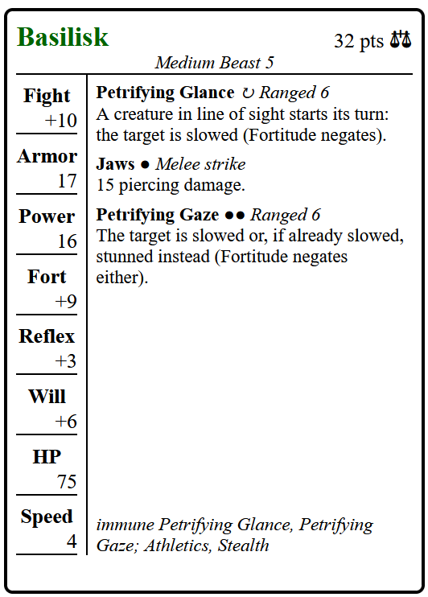
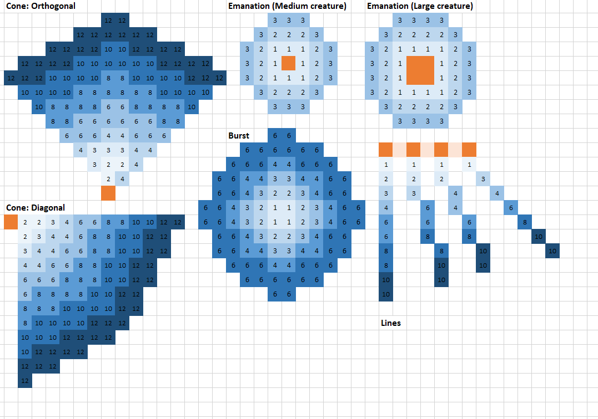
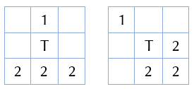
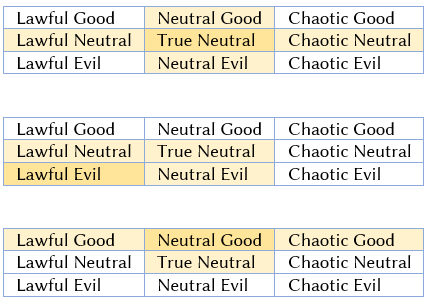
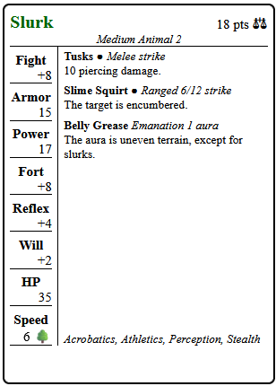

# Path 2 Victory

**The skirmish game inside PF2e**

*Path 2 Victory* is a hack of PF2e that turns the expansive roleplaying game into an accessible miniatures skirmish game. 

2024, version 1.6

## Introduction

*Path 2 Victory* is a miniatures skirmish game, which means you use miniature figures to represent the creatures in your party, and you move them around a board with scenery where they fight one another and pursue other objectives. Every creature has stats, actions and other details associated with it, which are detailed on its creature card. 

*Path 2 Victory* can be played on a one-inch grid, or you can play without a grid and use rulers and measuring tapes to measure distances. One inch in game represents five feet in the real world.

Along with the basic rules, this book describes three “game modes” that change how you play: “matched play” for competitive games, “solo adventuring” to play through PF2e adventures by yourself and “wargaming” that resembles other miniatures games.  

*Path 2 Victory* is open source and community-built, which means you can homebrew it to your needs. 

## How was *Path 2 Victory* created?

*Path 2 Victory* is a standalone game, but it is heavily based on – and mostly cross-compatible with – the popular tabletop roleplaying game PF2e. *Path 2 Victory* differs from PF2e in several major ways: 

* Each creature has a points cost associated with it, based on how powerful it is. 
* There are rules for deployment, scoring objectives and when the game ends. 
* The [Proficiency without Level](https://2e.aonprd.com/Rules.aspx?ID=1370) variant rule applies, which makes fights between creatures of very different levels still viable. 
* By default creatures get two actions (called “action points”) instead of three on their turn.
* A round consists of players alternating activating creatures until all creatures have acted. 
* Conditions have been simplified, and by default creatures lose every condition at the end of their turn. 
* Damage can be of multiple types (5 fire and poison damage, for example).
* Resistance has been turned into a random roll so that all creatures have a chance to do damage. 
* There are new rules for cover to allow for a creature to be hit if it provides cover to another. 
* Spellcasters get fewer spells, but cast all of them at the highest rank possible. 

Some of the most significant of these changes were originally suggested by GluMaz [on Reddit](https://www.reddit.com/r/Pathfinder2e/comments/fnmo01/pathfinder_2e_as_base_rules_for_skirmish_wargaming/). 

You can import characters, monsters, spells, variant rules, magic items and all the rest into *Path 2 Victory* with a few changes (described in the appendix). 

## ORC License

This product is licensed under the ORC License to be held in the Library of Congress and available online at various locations including paizo.com/orclicense, azoralaw.com/orclicense and others. All warranties are disclaimed as set forth therein.

This product is based on the following Licensed Material:

>  **Pathfinder Player Core** © 2023 Paizo Inc., Designed by Logan Bonner, Jason Bulmahn, Stephen Radney-MacFarland, and Mark Seifter. Authors: Alexander Augunas, Kate Baker, Logan Bonner, Jason Bulmahn, Carlos Cabrera, Calder CaDavid, James Case, Eleanor Ferron, Steven Hammond, Joan Hong, Vanessa Hoskins, James Jacobs, Jenny Jarzabski, Erik Keith, Dustin Knight, Lyz Liddell, Luis Loza, Patchen Mortimer, Dennis Muldoon, Stephen Radney-MacFarland, Mikhail Rekun, David N. Ross, Michael Sayre, Mark Seifter, Kendra Leig Speedling, Mark Thompson, Clark Valentine, Andrew White, Landon Winkler, and Linda Zayas-Palmer
>
> **Pathfinder GM Core** © 2023 Paizo Inc., Designed by Logan Bonner and Mark Seifter. Authors: Amirali Attar Olyaee, Logan Bonner, Creighton Broadhurst, Jason Bulmahn, James Case, Jesse Decker, Eleanor Ferron, Fabby Garza Marroquín, Jaym Gates, Matthew Goetz, James Jacobs, Brian R. James, Jenny Jarzabski, Dustin Knight, Jason LeMaitre, Lyz Liddell, Luis Loza, Ron Lundeen, Stephen Radney-MacFarland, David N. Ross, Michael Sayre, Mark Seifter, Owen K.C. Stephens, Amber Stewart, Clark Valentine, Landon Winkler, and Linda Zayas-Palmer
>
> **Pathfinder Monster Core** © 2024 Paizo Inc., Authors: Alexander Augunas, Dennis Baker, Kate Baker, Joshua Birdsong, Joseph Blomquist, Logan Bonner, Jason Bulmahn, James Case, John Compton, Paris Crenshaw, Adam Daigle, Darrin Drader, Brian Duckwitz, Robert N. Emerson, Scott Fernandez, Eleanor Ferron, Leo Glass, Matthew Goodall, BJ Hensley, Thurston Hillman, Vanessa Hoskins, James Jacobs, Jenny Jarzabski, Miko Kallio, Jason Keeley, Jeff Lee, Lyz Liddell, Luis Loza, Ron Lundeen, Robert G. McCreary, Philippe-Antoine Menard, Jacob W. Michaels, Dave Nelson, Jason Nelson, Tim Nightengale, Stephen Radney-MacFarland, Mikhail Rekun, Patrick Renie, Alex Riggs, David N. Ross, Michael Sayre, Mark Seifter, Chris S. Sims, Amber Stewart, Jeffrey Swank, William Thompson, Jason Tondro, Clark Valentine, Landon Winkler, Tonya Woldridge, and Linda Zayas-Palmer

If you use our Licensed Material in your own published works, please credit us as follows:

>  **Path 2 Victory** © 2024

**Expressly Designated Licensed Material:** The entirety of this product is Expressly Designated Licensed Material.

# Creature cards

Creatures are the living (and unliving) participants of battles*.* Monsters, heroes, undead, bystanders and livestock are all creatures. Each creature is represented by a figure, and the special rules relating to that creature are printed on its creature card. 

**Name:** The name of the creature, in this case “Basilisk”. 

**Points Cost:** How strong or valuable the creature is in a party. In most games of *Path 2 Victory,* each player will put together a party of the same number of points, calculated by adding up the points cost of each creature in their party.

**Alignment:** The nine alignments are the factions of *Path 2 Victory,* and each has a corresponding symbol: 

| | Lawful | Neutral | Chaotic |
| --- | ---------------- | -------------- | ----------------- |
| **Good** | ☼ Lawful good    | ✿ Neutral good | ✯ Chaotic good    |
| **Neutral** | 👁️ Lawful neutral | ⚖ True neutral | 🌀 Chaotic neutral |
| **Evil** | ✊Lawful evil     | 👿 Neutral evil | ⛈ Chaotic evil    |

**Size:** How large the monster is. Tiny, Small and Medium creatures occupy a single square (1” by 1”). Large creatures occupy four squares (total 2” by 2”), Huge creatures nine squares (total 3” by 3”) and Gargantuan creatures sixteen squares (total 4” by 4”). Miniatures usually sit on a circular or square base the same width as the space that the creature occupies.  

**Traits:** Any details about the creature, like its body shape or origin. These have no effect by default, but some powers will refer to them (for example, a spell that affects beasts will affect a basilisk).

**Level:** The creature’s relative power, from -1 to 14.

### Stats

Each creature has eight stats.

**Fight:** Fight is how likely a creature is to hit with a strike (like a sword blow, arrow shot or targeted spell). 

**Armor:** A creature’s Armor is how hard it is to hit with a strike. 

**Power:** A creature’s Power is how difficult its special effects, called powers, are to resist. A dragon’s fiery breath or a medusa’s petrifying glare are powers, as are many offensive spells.

**Saving Throws (Fortitude, Reflex and Will):** These three stats work the same way: they can cause a power to be negated or have a diminished effect.

**HP:** HP (“hit points”) is the total amount of damage a creature can take before it becomes helpless and begins to die. The creature’s current HP begins at maximum, and is reduced as the creature takes damage. If the creature is healed, its current HP increases – but can never exceed the maximum HP. 

When a creature reaches 0 HP, it is dying. It falls prone, gains the helpless status and cannot act except to make recovery checks on its turn (more details under “Conditions and combat statuses” and “Dying”, below). 

**Speed:** Speed is the maximum number of squares the creature can move with a single Stride action. 

Some creatures have special movement modes, represented with a symbol. These include Flight, Burrowing, Wall Climb and Aquatic and are described under “Movement modes” below.

### Features

The special rules governing a creature, including the special actions that it can take, are described on its card. Each feature has some of the following details: 

**Number of Uses:** When a feature is marked with ☐, 🄳 or 🄴 it means that it can only be used that many times in a battle. Each time it is used, check off one of the boxes. Once all boxes have been checked off, it cannot be used again. 

The difference between the types of checkbox only matter for long-term play. In long-term play: 

* ☐ Consumable: After this box is checked off, it is never recovered. The potion is drunk or the scroll burns up.
* 🄳 Daily: After this box is checked off, it is recovered when creature rests for eight hours. 
* 🄴 Encounter: After this box is checked off, it is recovered after the scenario ends. 

**Name:** The name of the feature.

**Action Points:** Some features are actions; these only come into effect if the creature uses them. 

A creature typically gets two action points (AP) on its turn, which it spends to perform actions. A cost of 1 AP is indicated with “●”; a cost of 2 AP with “●●”. 

Some actions are reactions (indicated with ↻); they can be performed outside of the creature’s turn. From the start of the creature’s turn to the start of its next turn, a creature can only take one reaction. 

Some actions cost zero AP – these are called free actions and are indicated with “○”. If these have a precondition, they can be used outside of a creature’s turn if that precondition is met. Otherwise, these can only be performed on the creature’s turn. 

**Precondition:** Some features, especially reactions, may have preconditions that must be met before they can be used. For example, the basilisk’s *petrifying glance* can only be used if and when a creature within 6 squares and within line of sight begins its turn.

A feature does not *have* to be used just because its precondition is met. 

**Range/Area:** Some features have a range/area. This is how far away an eligible target can be and how large and what shape the effect is. “Melee” means a single target in an adjacent square (within one square, up, down, left, right or diagonal). “Ranged #” means a single target within that many squares. Others, like “Cone” and “Blast”, target an area rather than a creature and are explained in more detail later.

**Strike:** If an action is a strike, it will say so here. 

When a creature makes a strike, it rolls a 20-sided die (1d20) and adds its Fight. If the result equals or exceeds the target’s Armor, the strike “hits”, meaning that it has the listed effect. 

**Effect:** The effect or rules of the feature. For a strike, this effect only applies if the strike hits. 

Some effects can be avoided or reduced in effect if the target fails on a saving throw. The entry will say something like “Will negates” or “Reflex half”. The target rolls a 20-sided die (1d20) and adds the specified saving throw (Fortitude, Reflex or Will). If the result equals or exceeds the attacker’s Power, then the effect is negated or the damage is halved (as applicable). 

Some features give a condition as an effect (for example, “slowed”, “stunned” or “rattled”). 

### Standard features

At the bottom of a creature’s card are listed in italics certain common features, without details. 

If a skill name is listed (like Acrobatics, Occultism or Society), it means the creature is trained in that skill. At certain times, for example to claim an objective or perform a physical feat like jumping or climbing, a creature must succeed on a skill check to be successful. To make a skill check, roll 1d20 and add the applicable saving throw. Subtract 5 if the creature is not trained in the skill. If the result exceeds the Power specified, the skill check is successful. 

“Immune”, “resist” and “weak” followed by a damage type indicate that the creature takes no damage, less damage or more damage from attacks doing that type of damage. Immune is also used for conditions; it means that the creature does not gain that condition, even if it otherwise would. 

# Getting started

## What you need to play

* Several miniatures each
* 20-sided and six-sided dice (“d20s” and “d6s”)
* Tokens to track conditions, damage, etc.
* A grid map 
* A way to draw or mark terrain and objectives

## Building a party

There are two ways to build a party in the basic rules. Other game modes are described in the appendices. 

**Narrative Play:** Each player chooses the creatures that are appropriate for the story. You can play *Path 2 Victory* as a rules-light roleplaying game, or use it to model a battle in an existing PF2e campaign. 

**Balanced, Unlimited Play:** Players agree on a number of points for each party. Each player selects creatures with total point costs equal to or below the number of points agreed. 

### Single most expensive creature

Unless playing a narrative game that has special requirements, no single creature should cost more than half of a party’s points. For example, a party of 200 points can contain a young red dragon (90 points) but not a crag linnorm (192 points).

### Points by level

The cost of a creature is calculated based on its level, plus a certain amount for every upgrade it has (if any). 

##### Table: Points cost by level

| **Level** | **Cost** | **Upgrade cost** | **Level** | **Cost** | **Upgrade cost** |
| --------- | -------- | ---------------- | --------- | -------- | ---------------- |
| **-1**    | 9        | 2                | **7**     | 48       | 8                |
| **0**     | 12       | 2                | **8**     | 60       | 10               |
| **1**     | 14       | 3                | **9**     | 72       | 12               |
| **2**     | 18       | 3                | **10**    | 90       | 15               |
| **3**     | 21       | 4                | **11**    | 108      | 18               |
| **4**     | 26       | 5                | **12**    | 135      | 23               |
| **5**     | 32       | 6                | **13**    | 160      | 27               |
| **6**     | 40       | 7                | **14**    | 192      | 32               |

#### Upgrades

Some creatures can take magic items or other add ons, or have optional upgrades specified on their creature card. Each upgrade increases a creature’s point cost (as shown in the table above). If a player brings multiple of the same type of creature, they can upgrade some and not others, or all.

# Setting up a standard game

*Path 2 Victory* can be played in many different ways, with different terrain setups, deployment rules, victory conditions and so on. What is described below are the standard rules, which can be modified by agreement of the players or if playing a particular scenario. 

1. Agree on a points cost for the game
2. Each build a party of that points cost or lower
3. Lay out a battle grid of appropriate size
4. Alternate placing terrain
5. Determine how many objectives are in play and alternate placing objectives
6. Roll to see who chooses their deployment zone first. Each player chooses a deployment zone and deploys their party in that zone. 

## Victory condition

Players are competing for whose party can win the most victory points, mostly from objectives. 

The player who has the most points worth of creatures in their party still in play at the end of the game wins an additional +2 points, or +4 points if their opponent or opponents have no creatures still in play. 

## Battle grid 

Games of *Path 2 Victory* are played on a grid of one-inch by one-inch squares. The size of the grid depends on the size of the game: small (150 points or fewer per side), medium (500 points or fewer per side) or large (over 500 points per side). 

| **Points  per party** | **Battle  grid size**    |
| --------------------- | ------------------------ |
| **150 or  fewer**     | Small: 24 by 18 squares  |
| **500 or fewer**      | Medium: 36 by 24 squares |
| **More  than 500**    | Large: 48 by 36 squares  |

To play without a grid, see the wargaming mode. 

## Terrain

Players alternate placing pieces of terrain (see the Terrain chapter for more details) until about a third to a half of the board is filled with terrain. Everywhere else is open ground (squares with no special terrain). 

Terrain tiles are standardized terrain pieces that are all 8 squares by 5 squares in dimensions. You can play with terrain tiles instead for a more consistent experience. 

## Objectives

Objectives are desirable things on the board that characters may want to interact with or control – anything from treasure chests to wild animals and prisoners about to be sacrificed. Unless otherwise specified, objectives are difficult and obstructing terrain (see the Terrain chapter for more details), and a creature cannot end its move on the objective. 

Each objective has a skill listed and a Power, usually Power 15. If a creature adjacent to the objective Interacts with it, they make a skill check. On a success, they claim the objective for their party indefinitely, and until the end of the round their skill check result becomes the Power for any other party’s attempt to claim the objective. 

At the end of each round, each party scores 1 Victory Point for each objective they currently have claimed (whether they claimed the objective in that round or an earlier round).

### Standard objectives

Roll 2d6 and take the higher result. Players alternate placing objectives on the map until they have placed that many objectives. Players choose objectives from the standard objectives below. No type of objective can be placed more than once. 

Each objective is associated with several skills. 

| **Objective**      | **Skill 1** | **Skill 2**  | **Skill 3**  | **Skill 4** |
| ------------------ | ----------- | ------------ | ------------ | ----------- |
| **Book**           | Arcana      | Lore         | Occultism    | Religion    |
| **Device**         | Arcana      | Crafting     | Thievery     | Medicine    |
| **Exotic Flower**  | Medicine    | Nature       | Survival     | Thievery    |
| **Golem’s Eye**    | Acrobatics  | Crafting     | Stealth      | Thievery    |
| **Notable**        | Deception   | Diplomacy    | Intimidation | Society     |
| **Savage Beast**   | Athletics   | Intimidation | Nature       | Performance |
| **Spectral Haunt** | Diplomacy   | Occultism    | Performance  | Religion    |
| **Willful Sprite** | Deception   | Society      | Lore         | Survival    |

When an objective is placed, roll 1d6 to determine its Power and which skills can be used to claim it. 

| **d6** | **Result**                    |
| ------ | ----------------------------- |
| **1**  | Skill 1 or 2, Power 15        |
| **2**  | Skill 2 or 3, Power 15        |
| **3**  | Skill 3 or 4, Power 15        |
| **4**  | Skill 1 or 4, Power 15        |
| **5**  | Any of the 4 Skills, Power 15 |
| **6**  | Any of the 4 Skills, Power 20 |

## Deployment

Deployment takes place in the deployment zones specified by the size of the battle grid. 

At the start of the first round, each player rolls a d20. The player that rolls highest chooses their deployment zone, and places all of their creatures in that zone. Then, clockwise from that player, each player chooses a zone and places all of their creatures. 

In other words, the player who picks last gets to deploy their creatures knowing how the other players are deployed. This hopefully compensates them for having fewer options (or just one option) for their deployment zone. 

| **Points  per party** | **Deployment  zones**                                 |
| --------------------- | ----------------------------------------------------- |
| **150 or  fewer**     | Up to 6 squares from the corner,  in opposite corners |
| **500 or fewer**      | Up to 6 squares from the corner, in  opposite corners |
| **More  than 500**    | Up to 6 squares from the edge,  in opposite edges     |

For free-for-all games where there are three or four players all fighting each other, go one size larger and always deploy in corners.

# Rounds and turns

A *Path 2 Victory* game takes place over several rounds. 

Every creature gets one turn to act each round. Players alternate activating creatures from their party to take a turn. Once a creature has completed its turn, the next player gets to activate a creature to take their turn, and so on until every creature has been activated. If a player has activated all of their creatures, skip them until the rest of the players have activated all of their creatures.

Once all creatures have been activated, the round ends and a new one begins. The first player to activate is the one to the left of the player who was first to activate in the previous round. 

### Roll to see who goes first

Each player rolls 1d6. Whichever gets the higher result goes first in round 1 (“first player”). Then, whichever player activated a creature last in the earlier round goes first in subsequent rounds.

### Round limit

If both players agree to play to a fixed time limit, at the end of round 6 and every round after, roll 1d6 and add the number of rounds that have occurred. If the result equals or exceeds 12, the game ends immediately. Otherwise it continues. 

## Taking a turn

The player activates a creature in their party that has not yet been activated this round. 

### Two action points

At the start of each of its turns, a creature’s action points (AP) are set to 2. It can spend these action points on one or more actions: actions cost either 0 AP (○, also called free actions), one AP (●) or two AP (●●). 

A creature cannot save its action points for a later turn. If it does not spend them, it loses them. 

Unless otherwise specified, a creature can take a particular free action only once per turn. Actions costing 1 AP that can only be performed once per turn are therefore written “●○” to indicate that they only cost 1 AP, but cannot be performed twice in a round. 

### Group activation

A player can activate a group of creatures in their party at once. The creatures must have spent the whole game adjacent to at least one other creature in the group. They must all spend their action points on the same actions and in the same order, though the details can be different (e.g. if they all Stride, they can move in different directions; if they Strike, they can choose different targets or use different weapons). If the group breaks up, all the creatures in it must then be activated separately; the group cannot reform. 

### End of turn

At the end of a creature’s turn, if it is suffering from persistent damage it takes that much damage. Then roll 1d6. On a 4 or higher, it loses that persistent damage effect. Otherwise, the persistent damage effect remains. 

The creature then loses all conditions it is experiencing. 

## Reactions

Outside its turn, a creature can take a reaction. A creature can take at most one reaction until it next activates. 

## Universal actions

The following are actions that any creature can take, unless otherwise specified. “You” refers to the creature taking the action. 

**Crawl** ● Move 1 square while prone.

**Drop Prone** ● Become prone.

**Escape** ● Choose a condition currently affecting you. Roll 1d6. On 4 to 6, the condition ends immediately. 

**Grapple** ● Choose an adjacent target no more than one size larger than you. Make a Fight roll. They make a Fortitude save (Power equal to the Fight roll result). On a failure, it is grabbed.

**Interact** ● Ready an item, open a door, manipulate an item or claim an objective.

**Leap** ● Jump over 1 square or over a one-square gap. 

**Long Jump** ●● Stride, then make an Athletics skill check. Divide the result by 4 (round down): that is how many squares you jump over or how wide a gap you can jump. If that is not enough, you fall.  

**Ready** ●● Your turn ends. Before your next turn, you can take a free action or 1-AP action as a reaction, at any time. 

**Shove** ● Choose an adjacent target no more than one size larger than you. Make a Fight roll. They make a Fortitude save (Power equal to the Fight roll result). On a failure, it is pushed 1 square. 

**Stand** ● Stand up from prone. If a creature is already in your space, either you or them move to the nearest empty space (their choice). 

**Step** ● Move 1 square. This movement does not trigger reactions.

**Stride** ● Moves up to your Speed in squares.

**Strike** ● Make an attack with a melee or ranged weapon. 

**Trip** ● Choose an adjacent target no more than one size larger than you. Make a Fight roll. They make a Reflex save (Power equal to the Fight roll result). On a failure, it falls prone. 

# Movement and positioning

When a creature Strides or Steps (or takes another action that allows them to move), they move a number of squares, as chosen by their player. They cannot move more than their Speed (if Striding) or more than 1 square (if Stepping). They can move fewer squares than they are entitled to. 

Creatures cannot move through solid terrain (described below) or through the spaces of enemy creatures, and they cannot end their movement on spaces occupied by allied creatures.

Some movement, like moving through difficult terrain or moving diagonally, costs more movement. If a creature Strides or Steps two or more times consecutively, they add up all the available movement for the purpose of these calculations. 

For example, a creature with Speed 5 who Strides twice can cross five squares of difficult terrain if they Stride twice. A creature with Speed 5 who Strides once can only cross two squares of difficult terrain, and the extra square of movement goes to waste unless there is open ground they can move on.

### Diagonal movement

Because moving diagonally covers more ground, count that movement differently. The first square of diagonal movement a creature makes in a turn counts as 1 square, but the second counts as 2 squares, alternating between the two thereafter. For example, as a creature moves across 4 squares diagonally, count 1, then 2, then 1, and then 2, for a total of 6. A creature’s total diagonal movement is tracked across all of their movement during their turn.

A creature can move diagonally past an enemy creature’s space – this does not count as passing through their space – and past difficult terrain. 

A creature cannot move diagonally past solid terrain, since it represents a hard corner. 

### Unwilling movement

A creature can be pulled, pushed or shunted. The attacker moves the target up to the specified number of squares. This cannot move the target into squares occupied by other creatures (allies or enemies). A push must move the creature further away from the attacker or point of origin with each square moved; a pull must move the creature closer to the attacker or point of origin with each square moved. A shunted creature can be moved anywhere. 

### Movement modes

Some of these movement modes allow creatures to ignore terrain or other creatures. The creature must still end its turn in an unoccupied space.

**≋ Aquatic:** The creature ignores the negative effects of water terrain (shallow and deep). 

**🕳 Burrowing:** The creature can choose to ignore the effects of terrain, auras and enemy creatures during its movement. The creature “resurfaces” when it ends it movement, at which point it can be affected by terrain, auras and creatures. Burrowing creatures still fall if they enter a void. 

**☁ Flight:** The creature can choose to ignore the effects of terrain (except solid terrain), and move through spaces occupied by enemy creatures.

**🌳Wall Climb:** The creature is not off-guard while on an incline and can climb or stay on any incline however steep. 

While adjacent to solid terrain, the creature can (a) ignore the effects of terrain (except solid terrain) and (b) move through spaces occupied by enemy creatures. (In the fiction, the creature is climbing along the wall out of the way.)

**✪ Teleportation:** The creature ignores the effects of terrain, auras and enemy creatures during its movement, and can move through spaces occupied by enemy creatures. The creature reappears when it ends it movement, at which point it can be affected by terrain, auras and creatures.

### Carrying objects

During a scenario, a creature will sometimes end up carrying something, for example a sacred idol. 

While carrying a Light Load, a creature has the encumbered condition. While carrying a Heavy Load, a creature has both the encumbered and slowed conditions. 

Dropping a Load is a free action. Picking up an unattended Load requires the Interact action (1 AP). 

### Vertical movement

Movement modes like Flight, Burrowing and Wall Climb that assume vertical movement just allow a creature to ignore terrain, not to physically move higher up (and potentially out of range). 

**Incline:** While standing on an incline, ladder or the like, a creature is off-guard. 

If an incline is too steep, creatures cannot traverse it at all without the aid of ropes, ladders or the like, or the Wall Climb movement mode. Some creatures cannot climb at all (like large mammals). Use your discretion. 

**Ascending:** To ascend a vertical distant costs 1 square per square of height gained. For example, climbing a 3-square tall ladder and then stepping off it costs 4 squares of movement (three for the vertical movement and one for the horizontal movement). 

**Descending:** Descending costs no extra movement beyond the horizontal movement involved. 

**Falling:** A creature that falls 2 squares or more takes 5 damage per 2 squares it falls. If it takes damage, it falls prone at the bottom. Creatures with Flight do not fall, and creatures with Wall Climb only fall until they become adjacent to solid terrain. 

A creature falls if there is no rope, ladder or the like by which to descend a steep or sheer drop, or if they are forced off a steep or sheer drop by unwilling movement. 

### Narrow spaces and tight gaps

A creature can cross a space narrower than their own space if it has a void on one or both sides. Narrow spaces count as uneven terrain, but if a creature falls prone on a narrow space, they roll 1d6. On a 1 to 3, they fall into the void. 

A creature can squeeze through a space half its base width or wider, but treats every square as difficult terrain. 

# Terrain

Pieces of terrain represent anything from forests, cliffs, giant skeletons, castle ruins or fields of poisonous mushrooms to rooms in a building or dungeon. Each square in a piece of terrain is either open ground (a flat space with no special features) or has one or more terrain traits, like a “concealing” cloud of smoke or “encumbering” sticky spiderwebs. 

A terrain piece can all have the same terrain trait (every square in the piece is filled with mushrooms, making it difficult terrain, for example) or different squares in the piece can have different traits (a ruin might have stone walls with the solid trait; piles of rubble with the difficult trait; and a flagstone floor which is open ground).  

A square can have one or more traits attached. For example, vegetation is obstructing difficult terrain. 

As well as filling squares, terrain can run along the border between squares. For example, a fence (difficult, obstructing) may run between two squares. Creatures can stand in the squares on either side of the fence. 

## Terrain traits

☁ **Concealing:** Grants concealment to creatures within it. A creature ignores the square(s) of concealing terrain it is standing on when determining concealment (whether as the attacker or defender).

〜 **Deep water:** Deep water can be traversed using movement, but at half speed. While swimming, a creature is off-guard. Shallow water is just a variety of difficult terrain. 

△ **Difficult:** It costs one extra square to enter each square of difficult terrain, or to cross difficult terrain between squares. 

▭ **Door:** An adjacent creature can open or close a door by Interacting. While closed, doors are solid terrain. 

➲ **Directional:** The terrain pushes creatures in a particular direction. Moving in any other direction is difficult terrain. At the end of each round, all creatures on the directional terrain are moved 2 squares in the set direction. 

🕸 **Encumbering:** If a creature enters encumbering terrain or ends their turn on it, they are encumbered.

☠ **Hazardous:** When a creature enters a hazard, they take 5 damage. At the end of a creature’s turn, they take 5 damage if they are on a hazard. Damage type depends on the hazard (piercing for a pit of spikes, fire for a fire pit, acid for a pool of acid, etc).

♣ **Obstructing:** Grants cover. A creature ignores the square(s) of obstructing terrain it is standing on when determining cover (whether as the attacker or defender). 

▦ **Opaque:** Blocks line of sight. A creature ignores the square(s) of opaque terrain it is standing on when determining line of sight (whether as the attacker or defender).

■ **Solid:** Solid terrain blocks movement, line of sight and areas of effect.

⨂ **Teleportation circle:** All Teleportation Circles are adjacent to all other Teleportation Circles on the map. 

**/ Uneven:** A creature entering uneven ground or beginning a movement while on uneven ground must make an Acrobatics check (Power 15). If they fail, they lose their movement. If they critically fail, they fall prone. While on uneven ground, a creature is off-guard. Each time a creature is hit by an attack or fails a save, they must make an Acrobatics check (use the attacker’s Power) or fall prone.

## Terrain types

To add more depth to your terrain, you can specify what *causes* your terrain to be concealing, difficult, obstructing, hazardous or the like. 

For example, in the caldera of a volcano the difficult terrain may be rubble, the concealing terrain smoke and the hazardous terrain magma. In an icy waste, the difficult terrain may be ice and the concealing terrain snowfall. 

Creatures may ignore some types of terrain but not others, for example in PF2E red dragons can see through smoke, winter hags can see through snowfall and some druids can move freely through undergrowth and vines. 

| **Terrain  traits**         | **Terrain  type**                       |
| --------------------------- | --------------------------------------- |
| **Concealing**              | Fog, mist, smoke, snowfall, dim  light. |
| **Difficult**               | Rubble, mud, ice.                       |
| **Difficult,  obstructing** | Fence, low wall, undergrowth,  curtain. |
| **Directional**             | Winds, river current, conveyor belt.    |
| **Encumbering,  difficult** | Cobwebs, vines, quicksand.              |
| **Hazardous**               | Gouts of flame, superheated steam.      |
| **Hazardous,  difficult**   | Magma, pool of acid, stone  spikes.     |
| **Opaque**                  | Darkness.                               |
| **Solid**                   | Wall                                    |
| **Uneven**                  | Slippery ice, slime.                    |

# Attacks and powers

Strikes and offensive powers are called attacks, and the creature making a strike or using a power is called the attacker. The creatures potentially affected by the strike or power are called targets. 

## Making a strike 

When a creature makes a strike, they make a Fight roll (roll 1d20 and add their Fight).

Compares the result of the Fight roll to the target’s Armor. If the Fight roll equals or exceeds the Armor, the strike hits. Otherwise, it misses.

If the Fight roll is a natural 20 (the die shows 20, ignoring modifiers) or the result exceeds the Armor by 10 or more (like a result of 27 or more against Armor 17), it is a critical hit. It hits and does double damage.

Some offensive spells involve strikes. 

#### Multiple attack penalty

After a creature concludes an action that included a Fight roll, their subsequent Fight rolls *that turn* suffer a -5 penalty. After a creature concludes a second action that included a Fight roll, their subsequent Fight rolls *that turn* suffer a -10 penalty. 

For example, a creature takes the Multiattack action and makes two strikes. After both strikes are resolved, it takes the Strike action and makes one strike. *That* strike suffers a -5 penalty. Then it takes the Shove action. *That* Fight roll suffers a -10 penalty. 

#### Ranged attack in melee penalty

A creature that is within an enemy’s reach suffers a -2 penalty to their Fight roll with ranged strikes. 

## Using a power

An attack power is any power that includes a saving throw, including some spells. When a creature uses an attack power, each target rolls a saving throw (rolls 1d20 and adds their Fortitude, Reflex or Will) and compares the result to the caster’s Power. If the result equals or exceeds the Power, the power is negated or has a diminished effect. If the result is less than the Power, the power succeeds and has the full effect. 

If the saving throw is a natural 1 (the die shows a 1, before modifiers) or it is below the Power by 10 or more (like a result of 7 or less against Power 17), it is a critical failure. The target takes double damage. 

### Saving throw types

**[Saving throw] negates:** If a saving throw is listed as “Fortitude negates”, or the like, it means the attack has no effect on that target if the target makes a successful saving throw, including doing no damage. 

**[Saving throw] half:** If a saving throw is listed as “Will half”, or the like, it means on a successful saving throw the power does half damage, and on a critical success (the saving throw is above the Power by 10 or more), it does no damage. 

Round damage down to the nearest 1 (for damage after halving of 9 or less) or down to the nearest 5 (for damage after halving of 10 or more). 

## Targeting 

To target a creature, an attacker needs (a) the target to be within range of the attack, (b) line of sight to the target and (c) line of effect to the target. 

To target a point of origin for an area of effect at range (for example, a burst 2 within range 10), an attacker needs (a) line of sight to the point of origin and (b) line of effect to the point of origin. The area of effect extends to its full extent, except where blocked by solid terrain. 

### Range

When measuring distances in squares, count the squares from the first square adjacent to the attacker to the square that includes the target (with diagonals alternating between costing 1 square and 2 squares). If the total is less than or equal to the range, the target is within range. 

Ranged strikes may have short and long ranges listed, for example “Ranged 12/24”. Attacks beyond the short range suffer a -2 penalty. 

### Line of sight 

Melee and Ranged attacks require the attacker to have line of sight to the target – in other words, to be able to see the target. 

If the attacking player can draw a line between any point on the space their attacking creature occupies and any point on the space the target occupies, without it passing through solid or opaque terrain, the attacker has line of sight. 

Area effects ignore opaque terrain: they have line of sight if they do not pass through solid terrain.

### Cover 

Cover refers to things that physically interfere with the attack. Foliage, a low wall and a fellow combatant are all forms of cover. Cover applies against strikes (attacks that target Armor) and against other attacks that target Reflex.

The attacking player chooses the point in the attacking creature's space from which the attack originates. The defending player then chooses any point in the target's space. Imagine a line between those two points. Use the same point on the attacker's space for each target if there are multiple targets. 

Make a cover check for:

* Each piece of obstructing, solid or opaque terrain that the line passes through.
* Each creature of the same size or smaller than both attacker and defender the line passes through.

In order from closest to the attacker to farthest from the attacker. If terrain is in the same square as a creature, roll for the terrain first. 

A cover check involves rolling 1d6. The first time the attacker rolls a 1, the attack targets the terrain or creature instead of the original target. If the thing in the way was already a target of the attack, they are only targeted once (so a soldier who provides cover against a dragon’s fiery breath is only affected once by that breath, even if they end up saving others behind). 

If no 1s are rolled, the original target remains. 

**Adjacent cover:** Defenders do not benefit from and attackers do not suffer from cover in their space. Attackers do not suffer from cover of one square or less in width that they are adjacent to (for example, archers can shoot out of arrow slits and duelists can swing swords over fences and low walls without penalty). 

**Larger creatures:** In the case of creatures that occupy multiple squares, the player who controls the attacking creature chooses which square to draw from of those the attacking creature occupies. 

### Concealment

Concealment refers to things that obscure the attacker’s view of the target, without physically blocking the attack. Fog, darkness and illusions are all forms of concealment. 

Concealment works like cover, except it only applies to strikes (attacks that target Armor), not attacks that target Reflex. 

Use the same line as for cover. Make a concealment check for: 

* Each piece of concealing terrain that the line passes through.
* The creature, if it is hidden or otherwise concealed by a spell or effect. 

Make the checks in order from closest to the attacker to farthest to the attacker. 

A concealment check involves rolling 1d6. If any concealment check results in a 1, the attack misses. 

**Larger creatures:** In the case of creatures that occupy multiple squares, the player who controls the attacking creature chooses which square to draw from of those the attacking creature occupies. 

### Height

Creatures are as high as they are wide (for example, a Large creature occupies 8 1-inch cubes: it is 2” wide by 2” long by 2” tall). Where elevation is an issue for determining line of sight, cover or concealment, draw the lines from points in these cubes rather than from ground level. This can mean creatures of smaller sizes now grant cover or creatures of larger sizes no longer grant cover depending on how the elevation changes their heights. 

### Adjacency

A creature is adjacent to another creature, or to terrain, an objective, etc., if it is in the next square over (orthogonally or diagonally).

By default, a Melee attack can target adjacent creatures. If there is a number after Melee, like Melee 2, it is a reach attack and can be used against creatures that many squares away (with adjacent squares counting as “square 1”). 

## Areas of effect

Areas are measured in the same way as movement, but areas’ distances are never reduced or affected by difficult terrain. They are blocked by solid terrain. 

If any of a creature’s space is within the area of effect, the creature is affected (even if other parts of their space are outside of the area of effect). 

**Emanations:** An emanation is measured from the sides of the origin space, usually the user’s space. Emanation 1 affects all squares adjacent to the user. 

**Bursts:** A burst is measured from a single corner of a square within the range of the effect, spreading in all directions to a specified radius. 

**Cones:** A cone is measured from a single edge or single corner of the origin space, usually the user’s own space. It covers a quarter-circle of space. 

**Lines:** A line is measured in a straight line from a single corner of the origin space. 

##### Figure: Areas of effect

# Hit points and damage

Hit points measure how far or close a creature is to becoming helpless and beginning to die. 

When a creature takes damage, subtract that amount from their current hit points (just called “hit points” or “HP”). At the start of each battle, a creature’s current hit points are equal to its maximum hit points. 

### Healing

When a creature is healed, they reduce the damage that they have taken/increase their current hit points by that value. A creature cannot be healed beyond its maximum hit points. 

### Dying

When a creature is reduced to 0 HP or lower, it gains the helpless status and falls prone. While its HP are 0 or lower, it is dying. 

Each time a dying creature’s turn ends, and each time it is hit by a strike that damages it, it makes a recovery check: it rolls 1d6. On a 1–3, it is eliminated and its figure is removed from play. 

If a dying creature is healed, their current HP becomes the value of the healing provided (for example, a dying creature on -8 HP healed 5 hit points sets their current HP to 5). They cease to be helpless (but they are still prone). 

### Looting

Keep track of where each creature is eliminated. A creature on or adjacent to that space can Interact with the body to take one item from it, or to begin carrying the body if the body is the same size or smaller than the creature. A body is a Heavy Load if it is the same size as the creature carrying it, or a Light Load if it is smaller. 

### Damage types

There are 12 types of damage: bludgeoning, piercing, slashing, acid, electricity, cold, fire, sonic, mental, poison, vitality and void.

Vitality damage only damages undead and void damage does not damage undead or constructs.

Damage can have two or more types, for example “5 fire and electricity damage”. 

### Temporary HP

Creatures can acquire temporary HP, separate to their current HP and not limited by their maximum HP. When a creature takes damage, subtract it from temporary HP first. 

Temporary HP does not stack; if a creature gets temporary HP from two sources, use the higher value. 

### Immunity, resistance and weakness

**Immune:** A creature takes no damage from an attack of a damage type to which they are immune, even if it involves other damage types as well.

**Resist:** When a creature with resistance to a particular damage type takes damage of that type, roll the specified number of d6s. For each 4+ result, reduce the damage it takes by 5. 

If a creature takes damage of multiple types, only roll the higher resistance value. 

*For example, a creature with resist cold 2d6 takes 15 cold and acid damage. Their player rolls a 5 and a 2, reducing the damage by 5.* 

**Weak:** A creature with weakness to a particular damage takes that much additional damage each time it takes damage of that type, even if the damage is of other types as well. Choose the higher value of weakness if the creature is weak to multiple types of damage from that attack. 

If a creature both resists and is weak to a source of damage, roll resistance first. If it still takes damage, add the extra damage from its weakness. 

### Persistent damage

A creature takes persistent damage at the end of its turn, then it reduces by 5 (from persistent fire damage 10 to persistent fire damage 5, for example). Once it reaches 0, it is removed. 

Persistent damage of the same type does not stack. Persistent damage of different types does stack. 

# Spells

Every creature that can cast spells is described as a caster of a particular tradition and rank. 

The traditions are occult, arcane, divine and primal. These determine which spells the caster can learn.

A caster’s rank describes how powerful the spells they cast are, and the maximum rank of spell they can cast. A Caster Rank 7 can cast rank 7 and below spells. 

## Interpreting spells

Spells are magical actions. Like other actions, casting spells costs AP or a reaction. If multiple actions are described in the one spell, only one of them can be taken. For example, the *heal* spell reads

● Melee: 5 void damage (Fortitude half).  
●● Ranged 6: 5 void damage (Fortitude half).  
●●● Burst 4: 5 void damage (Fortitude half).   
*Heighten (+1; any of the three options):* +5 damage.

The caster can get one of three effects, depending on how many AP they spend. “Heighten” means a caster of higher rank heals more damage. 

If a spell is listed as a strike, then the caster makes a Fight roll and compares it to the target’s Armor. Only if the attack hits does the spell’s effect take place. Otherwise, a spell’s effect is automatic (though the target may avoid the effect, for example by making a saving throw that negates it). 

### Rank and heightening

Spells have a minimum rank, which is the lowest rank of caster that can cast them. 

When a spell of a particular rank is cast by a caster of higher rank, it can have a more powerful or different effect. This is described under the spell’s “Heighten” entry. *Heighten (+1)* means apply that bonus once per rank it is heightened by. *Heighten (+2)* means apply that bonus once per two ranks it is heightened by (no effect if it is heightened just 1 rank). 

### Sustaining

A spell that has a sustain entry can be cast again on the caster’s next turn, for that many action points. It does not cost any uses of the spell to sustain. A spell can be sustained indefinitely, unless otherwise mentioned, but if it is not sustained in a given turn, it ends (you cannot sustain a spell one round, then not sustain it the next, then sustain it the round after). 

### Prepared and spontaneous casters

Prepared casters have a list of spells, each of which can be cast a certain number of times. 

Spontaneous casters can cast a certain number of spells, choosing from any applicable spell. 

The Kobold Sorcerer 1 is a spontaneous caster. They can choose between *bane, fear* and *charm* and could choose *bane* all three times. 

> 🄳🄳🄳 *Bane, fear, harm*

The Kobold Druid 1 is a prepared caster. It can cast *heal* once and *magic weapon* once. 

> 🄳 *Heal*, 🄳 *Magic weapon* 

# Hero points

A player can purchase up to three hero points for each of their creatures, paying the upgrade cost for that creature each time. 

A creature can spend a hero point to reroll a Fight roll, saving throw or check that they have made, or to make a creature targeting them with an attack reroll their Fight roll. Either way, use the second result.

A creature can spend a hero point just before making a recovery check. They pass that recovery check and all subsequent ones that they make in this encounter. 

# Skill checks 

When a creature makes a skill check, roll 1d20 and add the corresponding saving throw. If the creature is not trained in that skill, they suffer a -5 penalty. If the result is equal to or greater than the specified Power, the check succeeds. 

Mindless creatures can only make skill checks for skills they are trained in. The same is true for animals and beasts unless they are also humanoids, can cast spells or strike with a weapon.  

| **Skill**        | **Saving throw** | **Skill**       | **Saving throw** |
| ---------------- | ---------------- | --------------- | ---------------- |
| **Acrobatics**   | Reflex           | **Nature**      | Will             |
| **Arcana**       | Will             | **Occultism**   | Will             |
| **Athletics**    | Fortitude        | **Performance** | Will             |
| **Crafting**     | Will             | **Religion**    | Will             |
| **Deception**    | Will             | **Society**     | Will             |
| **Diplomacy**    | Will             | **Stealth**     | Reflex           |
| **Intimidation** | Will             | **Survival**    | Will             |
| **Lore**         | Will             | **Thievery**    | Reflex           |
| **Medicine**     | Will             |                 |                  |

# Commanders, minions and mounts

A commander is a creature that leads other creatures, called minions. The minions act on their commander’s turn (they can take actions in any order, including the commander taking an action, a minion taking an action, then the commander taking an action). 

A minion receives 1 AP per turn. The commander can give up 1 AP to give its minion +1 AP for that turn. A commander with more than one minion can give up more AP, but must give each AP to a different minion. 

### Mounts

Some creatures can be mounted by other creatures. 

When a creature mounts another, the mount becomes a minion and the rider its commander: the mount acts on its rider’s turn, and receives 1 AP per turn. If the rider dismounts, the mount goes back to normal.

There may be room for other passengers. These passengers get AP as normal. 

Commanders can make their attacks from any point on the mounted creature. Passengers must occupy a particular space, but can move about/change spaces any time with their own actions or whenever the mount Strides. This may limit passengers to reach or ranged attacks (for example if they are on a howdah on the back of a Huge elephant). 

If a mount falls prone, its commander and passengers dismount and are placed in unoccupied spaces around the mount. Make a Reflex save for each commander and passenger (against the mount’s Power): on a failure, they fall prone. If the mount is Huge or larger, the commander and passengers take falling damage as well if they failed their save.

# Conditions 

**Encumbered**: The creature suffers a -2 penalty to Speed and loses the Flight, Burrowing and Wall Climb modes. 

**Confused**: At the start of this creature’s turn, the opponent spends one of the creature’s action points and control the action the confused creature takes. The opponent cannot choose any limited-use actions.

**Controlled**: On the creature’s turn, the opponent spends the creature’s action points and controls the action(s) the controlled creature takes. The opponent cannot choose any features with a limited number of uses.

**Off-guard**: The creature takes a -2 penalty to Armor. If a creature receives the off-guard condition due to a combat status (for example, they are flanked or prone), they keep the condition until that combat status ends. 

**Grabbed**: The creature is immobilized and off-guard. This condition ends immediately if the creature is beyond the reach of all enemy creatures. 

**Immobilized:** The creature cannot willingly move from its current space. 

**Rattled**: The creature suffers a -2 penalty to Fight and Power. 

**Sickened**: The creature suffers a -2 penalty to saving throws. 

**Slowed**: The creature cannot take reactions and has one fewer action points on their next turn.

**Stunned**: The creature cannot take reactions and has no action points on their next turn. 

### Special conditions

Some creature cards describe other conditions. These also end at the end of the target’s turn unless specified. 

# Combat statuses

Combat statuses are circumstantial, sometimes beneficial, and do not typically go away on their own. 

**Flanked:** When a creature has enemy creatures on opposite sides of it, and those creatures are not helpless, the creature is flanked. While a creature is flanked, it is off-guard against all attackers. 

The target must be in reach of both flankers, and a line drawn from the center of one flanker’s space to the center of the other must pass through the target’s space. For example, if attacker 1 is in a given space, attacker 2 can be in a variety of other spaces to flank the target (T): 

**Helpless**: A creature that is dying is helpless. They cannot take actions (including reactions) or spend AP. When their turn begins, it ends immediately. The creature does not count as a creature for the purposes of affecting opponents (they can move through the helpless creature’s space, are not flanked by it, etc). 

**Invisible:** The creature cannot be seen, which means attackers do not have line of sight to it. Area of effect attacks can still affect an invisible creature as normal, as can the attacks of those with the True Seeing or Blindsight features.

**Quickened:** The creature gains +1 action point at the start of its next turn. It then loses the quickened status. 

**Prone:** The creature is off-guard and takes a –2 penalty to Fight. The only movement a creature can take while prone is to Crawl. A creature can take the Stand action to remove this status.

**Swallowed:** A swallowed creature shares a space with the swallower, but cannot be targeted by any effect. 

When a creature is first swallowed and at the start of each of its turns, it takes damage as specified on the swallower’s card. While swallowed, a creature is grabbed and slowed. It can use the Escape action, but must succeed on a Reflex save against the swallower’s Power to climb out of the gizzard of the swallower.

A swallowed creature can attack its swallower, who is off-guard against the attack. On a critical hit, the swallowed creature escapes. The swallowed creature also escapes if its swallower is reduced to 0 HP or below. 

When a creature escapes, place it in an unoccupied space adjacent to the swallower.

# Common features

**Aquatic Only:** You cannot move on land, only swim. 

**Commander:** This entry will specify which creatures are the commander’s minions. If it says “Starts with X” (such as “Starts with Wolf minion”), it means that if that commander is part of a party, then that minion is part of the party too (at no additional points cost).

**Scent:** Ignore the concealed status of adjacent creatures and treat adjacent invisible creatures as concealed instead. 

**Truesight/See Invisibility:** Ignore the invisible and concealed statuses of creatures. 

**Void Healing:** When you would heal, you take that amount as damage instead. When you would take void damage, you heal that amount instead. 

### Common actions 

The following are actions that are commonly available (but not universally available). They must be listed on a creature card to be used by that creature. 

**Swallow Whole ●** A creature of the listed size or smaller that is (a) grabbed and (b) within reach is swallowed (Reflex negates). When first swallowed and at the start of each of its turns, the swallowed creature takes the listed damage.

**Trample ●●** The creature Strides up to its Speed and may move through the spaces of creatures of smaller size. Each time it attempts to move through a creature, that creature makes a Reflex save. On a success, the trampling creature’s movement ends. On a failure, the creature is knocked prone and takes the listed damage. If the trampling creature’s space overlaps with that of other creatures at the end of its movement, move the other creatures to the nearest unoccupied spaces. 

### Common reactions

**Reactive Strike (also called Attack of Opportunity)** ↻ If a creature within your reach casts a spell, moves out of reach of your attacks or makes a ranged attack: Make a melee Strike against the triggering creature.

**Retributive Strike** ↻ If an enemy within 3 squares of you does damage to an ally within 3 squares of you: Reduce the damage taken by 2 + your level. If the enemy is within reach, make a melee Strike against the triggering creature. 

**Ferocity** ↻ If you would be reduced to 0 HP or below: Roll 1d6. On 4–6, set HP to 1 instead.

**Shield Block** ↻ If you take slashing, piercing or bludgeoning damage: Reduce damage by the specified amount. 

# Game mode: Solo adventuring 

In this variant, dice rolls determine how enemy creatures act, allowing a player to run an adventure or campaign by themselves.

The player’s creatures are referred to as “adventurers” and the AI’s creatures as “monsters”. Adventures from PF2e can be easily adapted to solo adventures in *Path 2 Victory*; an example is given at the end of this section.

## Early and late turns

At the start of each round, the player decides whether each adventurer will act early or late. 

Each adventurer that acts early gets 2 AP on its turn. If late, it gets 3 AP on its turn. 

Monsters can act “super-early”, typically only getting 1 AP or taking a special defensive action. 

Early adventurers act before early monsters, but after super-early monsters. Late adventurers act before late monsters. Allies of the adventurers act during the adventurers' turns, in the order the adventurers choose, even if those allies follow AI gambits.

Within each phase, the player decides which creature acts first (for example, the player chooses which of their early adventurers takes their turn first; they also choose which early monster takes its turn first.)

**Order:** Super-early monsters (Ⅰ), early adventurers, early monsters (Ⅱ), late adventurers, late monsters (Ⅲ).

## Gambits

Monsters have fixed actions on their turn, called “gambits”. To determine which gambit a monster uses, roll 1d6 for each type of monster (“Goblin Warrior”, “Flash Beetle”, etc.) at the start of each round (after the player has chosen whether each adventurer is acting early or late). 

The gambit will say which dice results lead to the monster pursuing that gambit, whether the monster is acting super-early (Ⅰ), early (Ⅱ) or late (Ⅲ), and which actions it is pursuing. 

Cardboard AI creatures do not have limited uses of their actions. The gambit system in effect reflects limited uses by having some actions be rarer than others. Similarly, cardboard AI creatures ignore the action point rules: they take whichever actions their roll dictates.

### Interpreting the entries

A slash between actions means the monster chooses one of those actions: preferring attacks over movement, and preferring melee attacks if it can make them over ranged attacks. 

An arrow means after taking the original action, the monster takes the subsequent action. 

### Targeting

Find out the monster’s “preferred” target, following this order until there is no ambiguity about who the monster targets:

1.    Enemies within range of their attack, or able to be within range with the movement the monster has available.
2.    (When using an area attack or attack with multiple targets) Maximising the number of enemies targeted. 
3.    Enemies listed as their “preferred” enemy.
4.    Enemies that are nearest.
5.    Enemies that are yet to act.
6.    Enemies with the lowest current HP.
7.    Enemies with the lowest Armor.

Monsters who have no enemies in range move towards whichever enemy they can get in range of with their movement, again preferring enemies based on the order given above. 

Monsters do not target helpless creatures. 

### Interpreting movement actions

**Shift:** The monster takes the Step action. If the monster has a melee action coming up, it Steps to get an enemy within reach. Otherwise, it Steps away from enemies. 

**Charge:** If the monster is already within melee reach of an enemy, it does not move. Otherwise, the monster takes the Stride action towards its preferred target. 

**Reposition:** The monster takes the Stride action towards its preferred target, even if it is already in melee reach of an enemy.

**Retreat:** The monster takes the Stride action moving as far away from all enemies as possible. 

**Stride:** The monster moves so its subsequent actions are most effective (into range, into reach, out of melee reach of enemies if it is making ranged attacks) against its preferred target. If it has no applicable subsequent actions, it moves into melee reach of its preferred target. 

### Adjudicating when AP are lost

Creatures following gambits do not gain or spend AP; they have a fixed set of actions that they take on their turn. This leaves the player(s) to adjudicate what happens when the game rules refer to AP, for example if a creature is slowed (losing 1 AP) or if the creature gets an opportunity to spend 1 AP for an effect. 

In general, a slowed creature should lose the last action from its programmed actions for the turn. Similarly, a creature that gets the opportunity to spend 1 AP should generally instead lose its last programmed action (if it has one) for the turn to "pay for" that effect. However, in either of these cases, if that means the creature doesn't get to use a big 2-AP or 3-AP action, consider dropping a different action from the ones the creature has programmed instead. 

### Example

Here are the gambits for the taxidermic dog. On a roll of 1, it takes no actions but becomes resistant to all damage. On a roll of 4, it acts in the early monster phase, by moving (preferring an enemy already adjacent to an ally even if it is already adjacent to another enemy) and then biting with its jaws. 

> **Gambits**  
> *Prefer enemies already adjacent to allies.*   
> ⚀ Ⅰ resist all 5 until the end of the round  
> ⚁⚂ Ⅱ Jaws > Reposition  
> ⚃⚄ Ⅱ Reposition > Jaws  
> ⚅ Ⅲ Stride > Jaws > Jaws

# Game mode: Wargaming

In this variant, players choose a faction and then build armies from within that faction. 

Rules for playing without a grid are provided, although there is no problem with playing on a grid if players prefer. 

Two example factions and a variety of alternative deployments and victory conditions are provided in separate PDFs. The deployments and victory conditions originally appeared in *Last Alliance* by Chris Sakkas.

## Factions

Two example factions are provided: the Doughty Kingdom and the Redolent Halls.

## Deployment zones

When playing with these alternative deployment zones (provided in a separate PDF), players alternate deploying a creature from their parties until all creatures have been placed.

## Victory conditions

If you are playing with one of these alternative victory conditions (provided in a separate PDF), do not place objectives unless specified. 

Where these rules refer to a party being “Broken”, it means three-quarters of the party by points cost is helpless or has been eliminated. 

If a player’s Victory Points exceed the other player’s by 5 or more, that player has won a major victory. Otherwise, they have won a minor victory. 

## Gridless play

For the most part, you can play *Path 2 Victory* without a grid by substituting “inches” any time the game refers to “squares”. Measure diagonal movement normally instead of imposing an extra cost for it. 

### Ranges

Something is within range if the distance between any point on the edge of the base of the attacker and any point on the edge of the base of the target is less than or equal to the range. 

### Adjacency

A creature is adjacent to another if there is less than 1 inch between both creatures’ bases. 

### Targeting

Look from the attacking figure’s perspective. If any part of the target figure is visible, the attacking figure has line of sight. If any part of the target figure is obscured, it has cover or concealment (as applicable). 

If any model that is sculpted unusually (for example, they are kneeling, or have been posed standing on a large rock), imagine it standing in a neutral pose to determine line of sight, cover and concealment. 

### Areas of effect

Measure emanations and bursts as circles of the radius specified (bursts are measured from a point, emanations from the edge of the base of the creature causing the emanation). 

Measure cones as quarter-circles of the radius specified. 

Measure lines as a line of no thickness of the length specified. 

# Game mode: Matched play

This game mode is for balanced, competitive play. 

## Building a party

In matched play, there are two other options for building a party: 

1. **Balanced, Limited Play:** As unlimited play, but each player selects an alignment, and then selects creatures of that alignment or adjacent alignments (see below).
2. **Random Box Recruitment:** Each player buys a couple of boxes of random pre-painted miniatures, and then selects creatures from their assortment with total point costs equal to or below 200 (or other agreed number). 

### Alignments

There are nine factions in *Path 2 Victory:* the nine alignments. Each player chooses an alignment for their party, but can also recruit those of “adjacent” alignments and True Neutral creatures. For example, a Lawful Evil party can also include Lawful Neutral, Neutral Evil and True Neutral creatures. 

## Terrain tiles

Terrain tiles are standardized 8-square by 5-square tiles that can be laid on a grid. They create a fair, consistent play experience. 

Each player chooses and places three tiles in a small game, four in a medium game and eight in a large game. 

Typically, between the tiles is open ground. Alternative scenarios could have void, shallow water, deep water, rubble, or solid terrain between the tiles, or have the tiles represent raised sections (with perhaps a 2-square drop to the ground below). However, different tile placement rules might be needed to have fair, balanced games.

Example terrain tiles are provided in a separate PDF. 

# Appendix: Campaign play

The following rules can be used to play with the same creatures over many scenarios. 

## Recovering

After a scenario, all creatures heal all damage and lose all conditions. All spell effects end. 

All features (including spells) that are usable once per encounter (🄴) are usable again. The scenario will specify if all features that are usable once per day (🄳) are usable again too. As a rule of thumb, creatures should recover their daily features after every third scenario. 

## Injuries

Roll 1d6 for each creature that was eliminated in the scenario. 

##### Table: Eliminated creatures

| **D6** | **Outcome**   | **Effect**                                         |
| ------ | ------------- | -------------------------------------------------- |
| 1–2    | Out of action | The creature cannot be used in  the next scenario. |
| 3–4    | Wounded       | Roll on the injuries table.                        |
| 5–6    | Full recovery | The creature is good as new.                       |

##### Table: Injuries

| **D6** | **Injury**  | **Effect**                                      |
| ------ | ----------- | ----------------------------------------------- |
| **1**  | Injured Leg | -1 Speed.                                       |
| **2**  | Injured Eye | -1 Fight.                                       |
| **3**  | Befuddled   | -1 Power.                                       |
| **4**  | Cursed      | -1 Fortitude, Reflex and Will.                  |
| **5**  | Fragile     | -1 Armor                                        |
| **6**  | Weakened    | Start the encounter with the slowed  condition. |

A creature that already has a wound that would become Wounded again instead has that wound permanently. Otherwise, a wounded creature that completes a scenario with that wound loses the wound. 

## Advancement

There are two methods of advancement: fixed and random. 

In fixed advancement, creatures advance to the next level upon completing three scenarios (or as otherwise specified in the scenarios). Their hit points and damage increase (as described below) and their saves (Fortitude, Reflex, Will), Fight, Armor and Power increase at fixed levels. They also gain a new feat at every even level. 

| **Level** | **Saves** | **Fight** | **Armor** | **Power** | **Feats** |
| --------- | --------- | --------- | --------- | --------- | --------- |
| **2**     |           | +1        | +1        |           | +1        |
| **3**     |           |           |           | +1        |           |
| **4**     | +1        | +1        | +1        |           | +1        |
| **5**     |           |           |           |           |           |
| **6**     | +1        | +1        | +1        | +1        | +1        |
| **7**     |           |           |           |           |           |
| **8**     |           | +1        | +1        |           | +1        |
| **9**     | +1        |           |           | +1        |           |
| **10**    |           | +1        | +1        |           | +1        |
| **11**    | +1        |           |           |           |           |
| **12**    |           | +1        | +1        | +1        | +1        |
| **13**    |           |           |           |           |           |
| **14**    | +1        | +1        | +1        |           | +1        |

### Feats

#### Level 1 feats

**Assurance:** Choose a skill. You always get a result of 8 + your skill modifier, if you rolled lower.

🄴 🄴 **Battle Medicine** ● Make a Medicine check (Power 15). On a success, heal 10 HP. On a critical success, heal 20 HP. 
 *From level 6,* you can choose to make a Medicine check (Power 20). On a success, heal 20 HP. On a critical success, heal 30 HP. 
 *From level 11,* you can choose to make a Medicine check (Power 30). On a success, heal 40 HP. On a critical success, heal 50 HP.

**Canny Acumen (Fortitude):** Increase Fortitude by +1.

**Canny Acumen (Reflex):** Increase Reflex by +1.

**Canny Acumen (Will):** Increase Will by +1.

**Combat Climber:** You are not off-guard while climbing.
 *Requires* Trained in Athletics

**Draconic Momentum** Recovers one use of Breath Weapon whenever you score a critical hit with a strike.
 *Requires* Breath Weapon 

**Feather Step:** You can Step into difficult terrain.

**Fleet:** Speed increases by +1. 

**Polearm Proficiency:** You have the range Melee 2 for one of your melee weapons. 

**Quick Jump** ● Make Athletics check. Result/4 = squares jumped over.

🄴 **Shield Block** **↻** When taking slashing, piercing or bludgeoning damage; *Effect* Reduce damage by 10. (15 at level 8, 20 at level 13). 
 *Requires* The user must wield a shield.

**Skill Training:** You become trained in a skill you choose.

**Titan Wrestler:** You can attempt to Disarm, Grapple, Shove, or Trip creatures up to two sizes larger than you.

**Toughness:** Increase maximum HP by 5. (10 at level 8, 15 at level 13). Add +1 to recovery rolls.

#### Level 3 feats

**Untrained Improvisation (Level 3):** You only suffer a -4 penalty when making skill checks with skills you are untrained in. 

#### Level 7 feats

**Battle Cry (Level 7)** ○ On your first turn in an encounter, you can take the Demoralize action as a free action. 
 *Requires* Trained in Intimidation

**Kip Up (Level 7)** ○ You stand up. This movement doesn’t trigger reactions.
 *Requires* Trained in Acrobatics

🄳 **Prescient Consumable (Level 7):** Choose one consumable item in your possession. Replace it with another of same or lower level. 

### Learning spells

A caster can Interact with a defeated enemy caster of the same tradition, that they are adjacent to. If so, make a note of the spells that the defeated caster can cast. When the original caster learns a new spell, they can choose from those spells as well. 

## Class table

Use this table to determine how a class is expected to progress in terms of damage and HP, and what the expected starting stats are for first level creatures of that class. 

When converting creatures over from PF2e, it is perfectly okay for their numbers to differ from those given here. They have been built using different, valid rules. 

##### Table: Expected class statistics at first level

| **Class**               | **Attack** | **Melee Damage** | **Ranged Damage** | **Armor** | **Power** | **Fort** | **Reflex** | **Will** | **HP**                                     |
| ----------------------- | ---------- | ---------------- | ----------------- | --------- | --------- | -------- | ---------- | -------- | ------------------------------------------ |
| **Alchemist**           | +6         | 5  (moderate)    | 5  (moderate)     | 14        | 13        | +6       | +6         | +6       | 20  +12 per level (2–7) +15 per level (8+) |
| **Barbarian**           | +6         | 8 (extreme)      | 6 (high)          | 14        | 13        | +9       | +6         | +6       | 25 +20 per level (2–7) +25 per level (8+)  |
| **Bard**                | +4         | 5 (moderate)     | 4 (low)           | 14        | 19        | +3       | +6         | +9       | 20  +12 per level (2–7) +15 per level (8+) |
| **Champion**            | +6         | 6 (high)         | 5 (moderate)      | 18        | 13        | +6       | +3         | +6       | 20 +15 (levels 2–7) + 20 (levels 8+)       |
| **Cleric (Cloistered)** | +4         | 5  (moderate)    | 4 (low)           | 12        | 18        | +3       | +6         | +9       | 20  +12 (levels 2–7) + 15 (levels 8+)      |
| **Cleric  (Warpriest)** | +6         | 5 (moderate)     | 4 (low)           | 15        | 16        | +6       | +3         | +9       | 20 +15 (levels 2–7) + 20 (levels 8+)       |
| **Druid**               | +4         | 5  (moderate)    | 4 (low)           | 14        | 18        | +6       | +6         | +9       | 20  +12 (levels 2–7) + 15 (levels 8+)      |
| **Fighter**             | +8         | 6 (high)         | 5 (moderate)      | 15        | 13        | +6       | +6         | +3       | 20 +15 (levels 2–7) + 20 (levels 8+)       |
| **Monk**                | +6         | 6  (high)        | 5 (moderate)      | 17        | 13        | +6       | +6         | +6       | 20  +15 (levels 2–7) + 20 (levels 8+)      |
| **Ranger**              | +8         | 6 (high)         | 6 (high)          | 15        | 13        | +6       | +6         | +6       | 20 +15 (levels 2–7) + 20 (levels 8+)       |
| **Rogue**               | +6         | 5  (moderate)    | 5  (moderate)     | 15        | 13        | +3       | +9         | +6       | 20 +12  (levels 2–7) + 15 (levels 8+)      |
| **Sorcerer**            | +4         | 4 (low)          | 4 (low)           | 12        | 18        | +3       | +6         | +6       | 15 +10 per level (2–7) +15 per level (8+)  |
| **Wizard**              | +4         | 4  (low)         | 4  (low)          | 12        | 18        | +3       | +6         | +6       | 15  +10 per level (2–7) +15 per level (8+) |

# Appendix: Converting from PF2e

Converting creatures from PF2e is more art than science, but here are some tips. 

*Path 2 Victory* uses the Proficiency without Level variant rule, so make sure to make the necessary adjustments first (subtract level from any number that includes Proficiency).

**Level, Alignment and Size:** Unchanged from PF2e.

**Points Cost:** Calculate based on the below table: 

##### Table: Points cost by level

| **Level** | **Cost** | **Upgrade cost** | **Level** | **Cost** | **Upgrade cost** |
| --------- | -------- | ---------------- | --------- | -------- | ---------------- |
| **-1**    | 9        | 2                | **7**     | 48       | 8                |
| **0**     | 12       | 2                | **8**     | 60       | 10               |
| **1**     | 14       | 3                | **9**     | 72       | 12               |
| **2**     | 18       | 3                | **10**    | 90       | 15               |
| **3**     | 21       | 4                | **11**    | 108      | 18               |
| **4**     | 26       | 5                | **12**    | 135      | 23               |
| **5**     | 32       | 6                | **13**    | 160      | 27               |
| **6**     | 40       | 7                | **14**    | 192      | 32               |

Cost is calculated as the XP that a level 5 party would receive from defeating that creature in PF2e. 

## Stats

**Fight:** Choose the highest attack bonus. 

**Armor:** Unchanged from PF2e (where it is called AC).

**Power:** Choose the highest DC listed. If none, set Power to Fight +9. Alternatively, if the creature has one strike at a significantly lower attack bonus than the others, could use that attack bonus +10 as the creature’s Power, and change the strike into a save-negates power. 

**Saving Throws:** Unchanged from PF2e. 

**HP:** Round to the nearest 5 if the creature has more than 10 HP.

**Speed:** Convert feet into squares by dividing by 5. Choose the highest speed among all movement modes, unless that represents a particularly niche movement. 

In *Path 2 Victory,* creatures have at most one movement mode. If a creature has multiple movement modes, choose the most useful (Burrowing is usually more useful than Aquatic or Wall Climb, and Flight is almost always the most useful). If one of a creature’s movement modes is much less than others (for example, walk 60 feet and fly 10 feet), ignore the slower movement mode. 

Aquatic creatures that cannot move on land at all (or barely, for example with a walk speed of 10 feet or less) should have the Aquatic Only feature. They are of little use in most games of *Path 2 Victory.* 

## Features

* Remove critical success and failure rules except where particularly interesting or important. 
* Simplify tracking or remove it altogether. For example, make a recharge power usable twice per encounter instead. If a fear effect can only affect a given monster once, abstract this by making the entire fear effect usable once per encounter. 
* When an action costs 3 AP, consider if an element can be removed from it to make an action that is balanced at 2 AP. Alternatively, it can be okay to just make an action that costs 3 AP cost 2 AP. 
* Because *Path 2 Victory* has 2 AP per turn instead of three, ignore “maintenance” actions like Raise Shield or the Fly action to remain in the air. *Path 2 Victory* is not fine-grained enough for these kinds of actions.  
* When an action requires a maintenance action, like a ranged weapon with Reload, an alternative option is to make the original action usable only once per turn. 

### Damage

* Consolidate different types of damage, so instead of doing 2 fire damage and 3 poison damage, a strike does 5 fire and poison damage. 
* Find the average damage and use that, rounding up. When this amounts to damage of 10 or more, round to the nearest 5. 
* Precision and bleed no longer exist as damage types – the associated damage still happens, but there are no special rules relating to precision and bleed damage.
* Instead of hardness, use resist all. 
* Replace every 5 points of resistance with 2d6 resistance (so resist 10 becomes resist 4d6). 

### Strikes

Where a lower-level creature has multiple weapon options, can reserve additional weapons as upgrades. 

Remove or consolidate attacks that are unlikely to see much use. 

In *Path 2 Victory,* the multiple attack penalty does not increase during an action. That makes some actions that allow for multiple attacks too powerful. Remove these actions or modify them. 

### Spellcasting

Creatures are casters of rank equal to the highest rank of spell that they can cast. This is different to the original game where casters would cast spells of different ranks. 

To figure out how many spells/spell slots the creature has available, follow this rough guide:

* Take the number of spells memorized/spell slots available for the highest rank of spells. 
* Add half the number of spells memorized/spell slots available for the next two highest ranks of spells.
* Subtract 2.
* Ignore all other spells memorized/spell slots available. 

For example, Grugach can cast three rank-4 spells, five rank-3 spells and seven rank-2 spells. He becomes a Caster Rank 4, with ((3 + 5/2 + 7/2) -2) spell slots, i.e. seven. 

For the specific spells known/memorized, choose spells that have a purpose in combat and suit the creature. 

### Areas of effect

Reduce areas of effect, from 16 to 8, from 12 to 8 and from 6 to 4. Powers with areas of effect of 1, 2 or 3 generally do not need to be reduced in area. 

### Conditions

Conditions almost always just last until the end of the creature’s next turn. 

* **Blinded:** Use rattled and encumbered instead. 
* **Broken:** Instead of breaking a creature’s weapons, they become rattled.
* **Dazzled:** Use rattled instead. 
* **Deafened:** Ignore, or choose a thematically appropriate condition. 
* **Fatigued:** Use off-guard or sickened instead. 
* **Frightened and fleeing:** Fear effects apply options like pushing the target, ending their action even if they have movement remaining or the rattled or dazed conditions.
* **Paralyzed:** Use stunned instead. 
* **Restrained:** Use immobilized instead. 
* **Stunned 1:** Use slowed instead. 
* **Lowered abilities conditions (clumsy, drained, enfeebled and stupefied):** Pick one of sickened, rattled or off-guard as seems appropriate. 

*Path 2 Victory* conditions are sometimes stronger than their PF2e equivalents to account for their shorter durations. But even when they are not stronger, keep in mind that *Path 2 Victory* battles often involve a wider range of levels (and therefore power levels) than PF2e encounters – so a lower-level character has a chance to immobilize, slow or stun a much higher-level character, albeit only for one round. 

#### Other conditions

Other conditions are not described in *Path 2 Victory* but can be used sparingly. You will see some examples in the same creature cards provided: 

* Cannot be healed 
* Cannot make attacks
* Cannot make ranged attacks 
* Charmed (cannot make attacks that target the caster or the space the caster is in)
* Petrified (remove from play and replace with a statue of the same size)

You can also proxy additional conditions or effects in a two-step process: saying that a certain event gives a creature an existing condition, and then giving it an additional rider when affected by that condition. 

For example, in PF2e the Craig Linnorm loses regeneration when it takes cold damage. In *Path 2 Victory,* the Craig Linnorm becomes sickened when it takes cold damage, and loses regeneration while sickened. The flavorful weakness is preserved, but no further tracking is needed beyond the existing *Path 2 Victory* condition system. 

## Example: The slurk

The slurk appears in *Monster Core.* Take alignment from its Legacy version: True Neutral. 

Size and traits can be copied directly. I order traits from more specific to less specific, rather than alphabetically. 

Level is the same, and gives us the creature’s points value: 18. You can have five slurk in a 100-point party. 

Calculate the creature’s attack bonuses, AC, saves and DCs (if any) as if the Proficiency Without Level rules were applied. The Archives of Nethys site can do this for you. 

* **Fight:** The slurk has a +9 attack bonus with its tusks and +7 with its slime squirt. You can take the higher (if it is the monster’s main attack) or average them. In this case, we’ll give the slurk Fight +8.
* **Armor:** The slurk has an AC of 15, so we give it an Armor of 15. 
* **Power:** The slurk’s Belly Grease action has a DC of 17, so we’ll make that the slurk’s Power. 
* **Saves:** Copy across the slurk’s Fortitude +8, Reflex +4 and Will +2. We won’t bother with its special bonus to Fortitude saves against grapples; that is too fiddly for *Path 2 Victory.*
* **Speed:** The slurk’s Speed of 30 feet becomes 6 squares, and since it has a climb speed we give it the Wall Climb special movement. 
* **HP:** The slurk’s HP of 35 is a multiple of 5 already, so we don’t need to round it up or down. 
* **Skills:** We give the slurk Acrobatics, Athletics, Perception and Stealth, since its bonuses with those skills are similar to the corresponding saves. 

**Tusks:** A tusks strike becomes the slurk’s first action. It costs 1 AP and is a Melee strike. 1d8+4 piercing damage averages 8.5 damage, which rounds up to 9 damage. It’s annoying to have damage that doesn’t go in increments of 5, so we might just increase it to 10 for simplicity’s sake. After all, we did reduce the slurk’s Fight relative to its tusks attack roll. 

**Slime Spurt:** A slime spurt costs 1 AP and is a Ranged 6/12 strike. The slash indicates the short and long range increments for the attack. 

*Path 2 Victory’s* encumbered condition (-2 to Speed) replaces Entangling Slime. Note that encumbered will only remain until the end of the creature’s turn, whereas Entangling Slime can last for the entire encounter. 

**Belly Grease:** We have two options with this feature: keep it as an action (reducing the cost to 2 AP, since creatures usually only get 2 AP on their turns in *Path 2 Victory*) and require players to track the changing terrain across the battlefield, or turn it into an aura that is always on, but that moves with the slurk. The latter seems easier, so we’ll go with that. It becomes an emanation 1 aura.